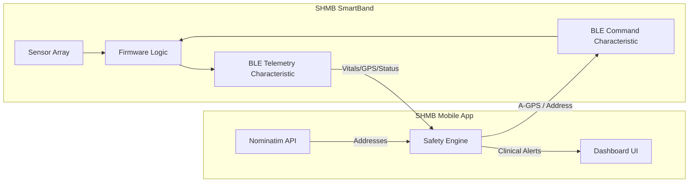

# SHMB System Overview: The Connected Platform

This document explains the high-level relationship and data flow between the SHMB Mobile App and the SmartBand Hardware.

---

## 1. High-Level Architecture
The SHMB system is designed as a distributed monitoring platform where the **Band** handles high-speed sensor data collection, and the **App** performs complex clinical decision-making and geocoding.

---

## 2. The Communication "Handshake"

The two devices stay in sync via a bi-directional Bluetooth Low Energy (BLE) bridge.

### Telemetry (Band ➡️ App)
Every **500ms**, the Band broadcasts a "Heartbeat" packet:
`P:2.1,R:-1.5,TO:36.6,TA:24.1,HR:72,SPO2:98,FALL:0,LAT:33.68,LNG:73.04,FIX:1,HAND:1,G:1.0,V:3.5.8`
*   **Purpose**: Updates the App dashboard with live vitals, orientation, and hardware status.

### Synchronization (App ➡️ Band)
Every **5 seconds**, the App pushes data back to the Band:
1.  **A-GPS (L:33.68,G:73.04)**: Calibrates the Band’s location using the phone's high-precision GPS.
2.  **Address (A:Sector G-6, Islamabad)**: Sends the human-readable location name for the OLED display.

---

## 3. Logical Division of Labor

| Aspect | SmartBand Responsibility | Mobile App Responsibility |
| :--- | :--- | :--- |
| **Location** | Raw Lat/Lng & Satellite Tracking | Reverse Geocoding & High-Precision A-GPS |
| **Vitals** | Signal Filtering & Peak Detection | Clinical Interpretation & Trend Analysis |
| **Safety** | Immediate Fall/Impact Detection | Motion-Aware Alerting & Persistence Windows |
| **Display** | Low-latency OLED Rendering | Rich Visual Dashboard & Map Visualization |

---
**Next Steps**:
*   [App Walkthrough](file:///Users/dev/Downloads/SHMB/documentation/app_walkthrough.md)
*   [Hardware Walkthrough](file:///Users/dev/Downloads/SHMB/documentation/hardware_walkthrough.md)
